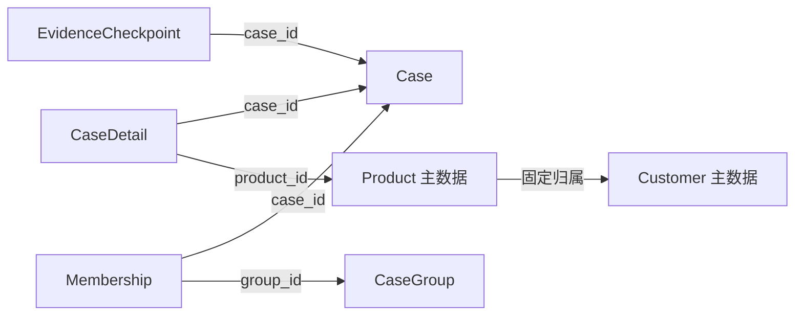
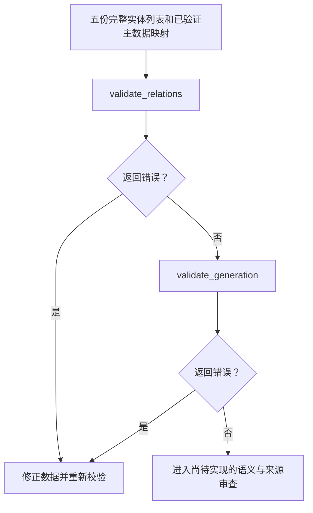

> 历史归档（2026-09-16）：本文件不是当前要求、状态或 Agent 指令；后续任务以 [Current Plan](../../../project/current-plan.md) 为准。原文中的“当前”“已完成”“冻结”等仅对应历史时点。

# 数据模型与校验器精简报告：改动前后与心智模型

日期：2026-09-14。范围：本次 `src/casetrace` 审查及配套测试、实现清单调整。

本报告是本次改动的快照，不新增业务规则。“改动前”指本次精简开始时的工作区，包含用户此前尚未提交的实现，不以 Git HEAD 作为比较基准。

字段和规则以 [冻结数据结构](../data/CaseTrace_Data_Structure_V2_No_Scenario.md)、[CR](../data/CaseTrace_Case_Constraint_Rules_Frozen.md)、[GR](../data/CaseTrace_Case_Generation_Rules_V1.md) 为准；持续维护的实现状态见 [Validator 实现清单](../data/CaseTrace_Validator_Implementation_Plan.md)。

## 1. 本次解决的主要问题

原模型把 Case 与子记录的同一归属关系保存了两遍：Case 保存子记录 ID 列表，Detail 和 Evidence 又各自保存 `case_id`。新增、删除或移动子记录时，两端都要更新。校验器因此需要额外判断两份关系是否相符。

冻结结构要求通过子记录的 `case_id` 表达归属。本次让内存模型采用同样的表示，减少可产生矛盾的状态，同时继续在完整 Dataset 上检查引用和最少数量。

## 2. 改动前后

| 部分 | 改动前 | 改动后 | 维护上的意义 |
|---|---|---|---|
| Case 与子记录关系 | Case 保存 `detail_ids`、`evidence_checkpoint_ids`，子记录另存 `case_id` | Case 删除这两个列表，仅使用子记录 `case_id` | 维护一份关系即可 |
| 子记录检查 | 检查双向引用、串挂、遗漏和实际数量 | 检查子记录引用有效，并确认每个 Case 实际具有 Detail 和 Evidence | 不再需要为重复表示编写同步校验 |
| `CaseBundle` | 把单个 Case、Group 和多类记录装入容器，实际未被使用 | 移除；Dataset 校验继续接收五份完整实体列表 | 调用范围更明确，避免把局部数据当成完整 Dataset |
| 必填检查辅助函数 | 名称为 `check_required_fields`，实际只检查文本 | 改为 `check_required_text_fields` | 名称准确表达职责，避免误以为涵盖日期和数量 |
| 模型注释 | 多处重复“非空”“唯一”，字段含义与校验职责混在一起 | 用中文说明实体职责、数量口径、时间含义和关联方式 | 阅读时更容易区分数据含义和校验行为 |
| 校验器说明 | 模块开头主要是占位说明和独立语法示例 | 模块说明列出三个入口、调用顺序和返回值含义 | 使用前就能了解覆盖范围 |
| 命令入口 | 输出 `Hello from casetrace!` | 输出当前仅有模型与确定性校验、尚无生成或检索命令 | 运行结果准确表达当前能力 |

相关文件：[模型](../../../../src/casetrace/data/dataset_model.py)、[校验器](../../../../src/casetrace/data/validators.py)、[命令入口](../../../../src/casetrace/__init__.py)。枚举仍集中在 [constants.py](../../../../src/casetrace/data/constants.py)。

## 3. 改动后的核心心智模型

### 3.1 五类对象各自保存自己的事实

| 对象 | 回答的问题 | 关系从哪里来 |
|---|---|---|
| `Case` | 这次完整调查描述了什么，最后如何结案和改善？ | 本身由 `case_id` 标识 |
| `CaseDetail` | 哪个产品的哪个生产批，在什么发现事件中纳入了多少处置数量？ | `case_id` 引用 Case；`product_id` 引用 Product |
| `EvidenceCheckpoint` | 本次调查做了什么检查，结果是什么，与原因是否相关？ | `case_id` 引用 Case |
| `CaseGroup` | 哪些 Case 被显式组织成一组，这组是什么类型？ | 组成员由 Membership 表达 |
| `Membership` | 某个 Case 为什么加入某个 Group？ | `(group_id, case_id)` 同时标识关系并引用两端 |



图中的箭头表示引用方向。Case 的完整调查内容，需要结合属于它的 Detail 和 Evidence 阅读；Case 对象自身不保存全部调查记录。

### 3.2 数据关系依然存在，只是不重复存储

例如有以下记录：

```text
Case: C1
Detail: D1 → C1
Detail: D2 → C1
Evidence: E1 → C1
```

要找 C1 的 Detail，可以按 `detail.case_id == "C1"` 筛选。之后新增 D3 时，只需把 D3 的 `case_id` 指向 C1 并加入 details 列表。

如果把 D1 移到 C2，修改 D1 的 `case_id` 后，关系入口会重新检查 C1、C2 的最少子记录数量。若某个 Case 因此没有 Detail，仍会违反 CR-01。

这里减少的是关系副本，业务规则继续由校验器负责。

### 3.3 Dataclass 是记录容器，构造成功不等于数据合法

`CaseDetail.affected_qty: int` 是类型注解。Dataclass 不会自动拒绝 `True`、负数或字符串；日期顺序、ID 引用和客户一致性也不会在构造对象时自动检查。

应把三个步骤分开理解：

```text
构造对象 → 执行确定性校验 → 审查业务语义和候选来源
```

因此不能只检查“对象是否创建成功”，也不能把空错误列表解释为完整业务验收成功。

### 3.4 Dataset 是完整校验范围

当前接口使用五个列表：`cases`、`details`、`evidences`、`groups`、`memberships`。它们共同构成传入本次校验的 Dataset，不需要再增加容器类。

检查一个 Case 的字段，可以只看该对象；以下规则必须看到完整范围：

- 各实体 ID 是否重复；
- 同一生产批跨 Case 的固定属性是否一致；
- 每个 Group 是否至少拥有两个不同的有效 Case；
- 整个生成 Dataset 是否符合复用批号数量要求。

调用方负责传入完整范围。函数无法仅凭五个列表判断调用方是否在外部遗漏了其他记录。

## 4. 校验入口怎样理解和使用

| 入口 | 负责什么 | 空列表能说明什么 |
|---|---|---|
| `validate_records()` | 字段类型、必填、枚举、日期顺序、异常列表内部重复等 | 字段阶段未发现错误 |
| `validate_relations()` | 先做字段守门，再检查实体关系、最少数量、批号一致性和主数据关联 | 已实现的确定性 CR 检查未发现错误 |
| `validate_generation()` | 字段守门后执行当前已实现的 GR 数量和复用批号检查 | 已实现的确定性 GR 检查未发现错误 |



`validate_relations()` 已包含字段检查，常规完整校验不需要先手动调用一次 `validate_records()`。`validate_generation()` 保留字段守门，方便报告错误输入，但不重复关系与主数据校验。

CR 和 GR 的边界继续保持：例如 `affected_qty=5001` 是正整数，可以通过 CR 数量检查，但违反 GR-06 的生成上限。同批不同事件的处置数量可能重叠，不能累加后当作去重批次数量。

## 5. 调用方需要适配的变化

Case 构造从七个参数变为五个参数：

```python
# 改动前
case = Case("C1", description, root_cause, corrective_action, None, ["D1"], ["E1"])

# 改动后
case = Case("C1", description, root_cause, corrective_action, None)
# D1 和 E1 各自通过 case_id="C1" 关联。
```

仓库内测试中的构造调用已更新。外部脚本若仍传入两个旧列表，需要同步调整。`CaseBundle` 已移除；直接调用旧辅助函数的脚本也需要使用 `check_required_text_fields`。

最少数量错误现在在关系阶段产生。相应错误定位字段使用 `details` 或 `evidences`，GR-01 的数量错误使用 `details`，不再引用已经删除的字段名。

## 6. 实际验证与本次边界

本次重构先调整关系测试，观察到旧模型因仍要求两个列表而失败，再修改实现并运行全套测试。

```text
uv run --frozen --offline pytest -q
98 passed, 169 subtests passed

uv run --frozen --offline casetrace
正常输出当前能力说明

git diff --check
通过
```

测试由重构前的 100 个、179 个子测试变为 98 个、169 个子测试：删除了针对已移除冗余表示的测试，并补充了新增子记录、移动归属后检查原 Case 最少数量等测试。数量变化不代表完整业务规则已全部覆盖。

本次没有实现主数据导入、生成器或语义审查，也没有新增依赖。`pyproject.toml`、`uv.lock` 等已有工作区改动不是本次精简新增的修改。

后续生成能力的缺口见 [Mock Case 前置条件与缺口报告](2026-09-14-mock-case-readiness.md)。
